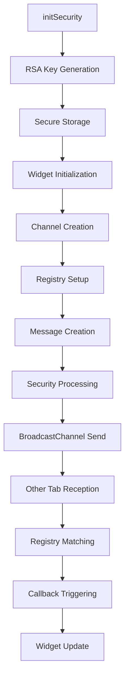
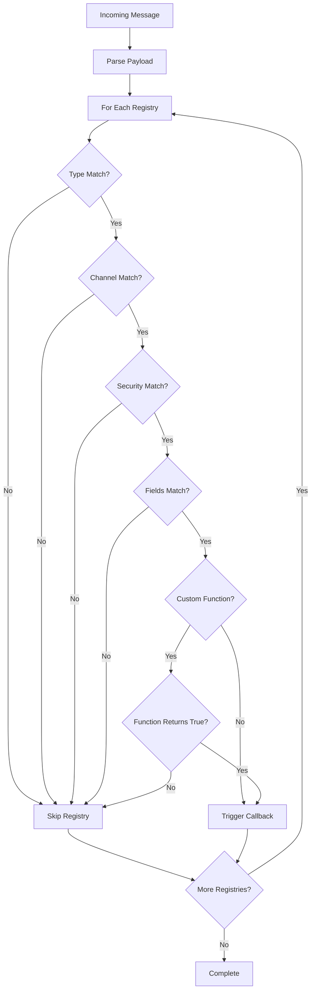

# System Patterns

## Architecture Overview

### Security-Layered Design
The PV Crosstab package implements a multi-layered security architecture:

```
┌─────────────────────────────────────┐
│          Application Layer          │
│   (Flutter Widgets & Components)    │
├─────────────────────────────────────┤
│         Communication Layer         │
│    (BroadcastChannel + Registry)    │
├─────────────────────────────────────┤
│          Security Layer             │
│  (Encryption, Signatures, Nonces)   │
├─────────────────────────────────────┤
│         Cryptographic Layer         │
│   (RSA Keys, Secure Storage)        │
└─────────────────────────────────────┘
```

### Complete System Flow
```
┌─────────────────┐    ┌─────────────────┐    ┌─────────────────┐
│  Widget Layer   │    │  Widget Layer   │    │  Widget Layer   │
│  (Tab A)        │    │  (Tab B)        │    │  (Tab C)        │
└─────────┬───────┘    └─────────┬───────┘    └─────────┬───────┘
          │                      │                      │
          ▼                      ▼                      ▼
┌─────────────────┐    ┌─────────────────┐    ┌─────────────────┐
│ CrosstabChannel │    │ CrosstabChannel │    │ CrosstabChannel │
│   + Registry    │◄──►│   + Registry    │◄──►│   + Registry    │
└─────────┬───────┘    └─────────┬───────┘    └─────────┬───────┘
          │                      │                      │
          └──────────────────────┼──────────────────────┘
                                 ▼
                    ┌─────────────────────┐
                    │  BroadcastChannel   │
                    │   (Browser API)     │
                    └─────────────────────┘
```

## Key Design Patterns

### 1. Factory Pattern for Security Levels
**Pattern**: Three distinct factory methods for different security requirements
**Location**: `lib/src/payload.dart`

```dart
// Unencrypted - for non-sensitive data
CrosstabPayload.unencrypted(data: {...}, type: 'notification', channelId: 'main')

// Signed - for integrity protection
CrosstabPayload.signed(data: {...}, type: 'command', channelId: 'admin')

// Encrypted - for full confidentiality
CrosstabPayload.encrypted(data: {...}, type: 'credentials', channelId: 'user-session')
```

**Benefits**:
- Forces developers to explicitly choose security level
- Prevents accidental use of wrong security level
- Clear API surface with obvious security implications
- Enhanced with type and channel routing metadata

### 2. Registry Pattern for Message Routing
**Pattern**: Declarative message matching with automatic dispatch
**Location**: `lib/src/registry.dart`

```dart
// Register for specific message types with glob patterns
channel.register(CrosstabRegistry(
  typeMatch: 'notification*',        // Matches notification, notification-urgent, etc.
  channelIdMatch: 'user-?',          // Matches user-1, user-a, etc.
  useEncryption: false,              // Only unencrypted messages
  fieldsMatch: ['message', 'priority'], // Must contain these fields
  callback: (payload) => handleNotification(payload),
));
```

**Benefits**:
- Declarative message routing without manual filtering
- Flexible glob pattern matching for complex scenarios
- Automatic dispatch to multiple matching handlers
- Security-aware filtering (encryption, signatures)
- Field presence validation including encrypted payloads

### 3. Interface-Driven Widget Integration
**Pattern**: Consistent API across different widget types
**Location**: `lib/src/widget.dart`

```dart
// Common interface for all cross-tab widgets
abstract class CrosstabInterface {
  Future<void> sendMessage(CrosstabPayload payload);
  void registerHandler(CrosstabRegistry registry);
  void onCrosstabMessage(CrosstabPayload payload);
}

// Stateless implementation
abstract class CrosstabStatelessWidget extends StatelessWidget 
    implements CrosstabInterface

// Stateful implementation  
abstract class CrosstabStatefulWidgetState<T> extends State<T>
    implements CrosstabInterface
```

**Benefits**:
- Consistent API regardless of widget type
- Automatic lifecycle management
- Built-in error handling and debugging
- Seamless Flutter integration with minimal boilerplate

### 4. Fail-Safe Security Pattern
**Pattern**: No fallbacks for security operations - fail explicitly
**Implementation**: Throughout cryptographic operations

```dart
// Bad (old pattern with fallbacks)
final checksum = map['checksum'] ?? '';

// Good (fail-safe pattern)
if (!map.containsKey('checksum') || map['checksum'] == null) {
  throw Exception('Missing checksum - payload integrity cannot be verified');
}
```

**Benefits**:
- Prevents silent security degradation
- Forces proper error handling
- Makes security failures visible and debuggable

### 5. Centralized Key Management
**Pattern**: Single source of truth for cryptographic operations
**Location**: `lib/utils/crypt.dart`

```dart
/// Initialize security system
await initSecurity();

/// Access keys through centralized functions
final publicKey = await getPublicKey();
final privateKey = await getPrivateKey();
```

**Benefits**:
- Consistent key storage and retrieval
- Single point for security initialization
- Easier to audit and maintain cryptographic code

### 6. Immutable Payload Pattern
**Pattern**: Payloads are immutable once created
**Implementation**: All fields are `final`, no mutation methods

```dart
class CrosstabPayload {
  final CrosstabPayloadHeader header;
  final Map<String, dynamic> data;
  // No setters, no mutation methods
}
```

**Benefits**:
- Prevents accidental modification of secure data
- Thread-safe by design
- Easier to reason about data flow

## Component Relationships

### Complete System Flow


### Registry Matching Flow


### Security Flow
1. **Initialization**: `initSecurity()` ensures keys exist
2. **Widget Setup**: Widgets initialize channels and registries
3. **Payload Creation**: Factory method determines security level with type/channel metadata
4. **Cryptographic Processing**: Signing/encryption as needed
5. **Channel Transmission**: Serialize and send via BroadcastChannel with message ID
6. **Registry Processing**: Automatic matching and dispatch to callbacks
7. **Widget Handling**: `onCrosstabMessage()` called for matching registries

## Critical Implementation Paths

### 1. Key Generation and Storage
**Path**: `crypt.dart` → `initSecurity()` → `generateAndStoreKeyPair()`
**Critical Points**:
- RSA key generation must complete successfully
- Secure storage must be available and working
- Keys must be accessible for payload operations

### 2. Widget Lifecycle Management
**Path**: Widget creation → Channel initialization → Registry setup → Message handling
**Critical Points**:
- Channel must initialize before registries are added
- Error streams must be connected for debugging
- Proper cleanup on widget disposal to prevent memory leaks

### 3. Message Routing Pipeline
**Path**: Message creation → Security processing → Channel send → Registry matching → Callback execution
**Critical Points**:
- Payload must pass validation before transmission
- Registry matching must handle all criteria types including glob patterns
- Callbacks must be isolated to prevent one failure affecting others

### 4. Payload Security Processing
**Path**: Factory method → Encryption/Signing → Serialization
**Critical Points**:
- Nonce generation must be cryptographically secure
- Private key must be available for signing
- Validation must catch all malformed inputs

### 5. Cross-Tab Communication
**Path**: Widget A → Channel → BroadcastChannel → Widget B → Registry → Callback
**Critical Points**:
- Message serialization must preserve all security metadata
- Registry matching must handle encrypted payload field checking
- Error handling must not break the communication flow

## Error Handling Patterns

### 1. Explicit Security Failures
```dart
// Cryptographic operations fail fast and clearly
if (privateKey == null || privateKey.isEmpty) {
  throw Exception('Private key not available - ensure initSecurity() has been called');
}
```

### 2. Registry Callback Isolation
```dart
// Individual registry failures don't break other registries
for (final registry in _registries) {
  try {
    if (await registry.match(payload)) {
      registry.callback(payload);
    }
  } catch (e) {
    _errorStreamController.add('Registry callback error: $e');
  }
}
```

### 3. Widget Error Handling
```dart
// Built-in error handling with debugging support
@override
void onCrosstabError(String error) {
  debugPrint('Crosstab error in ${widget.runtimeType}: $error');
  // Override for custom error handling
}
```

### 4. Validation-First Approach
```dart
// Validate all inputs before processing
if (!map.containsKey('header') || map['header'] is! Map<String, dynamic>) {
  throw Exception('Invalid payload: missing or invalid header');
}
```

### 5. Graceful Degradation
```dart
// Verification returns false rather than throwing for normal failures
try {
  final expectedSignature = await _createSignature(data);
  return expectedSignature == signature;
} catch (e) {
  print('Signature verification failed: $e');
  return false; // Don't throw - verification simply failed
}
```

## Data Flow Patterns

### 1. Security Context Propagation
Security information travels with the payload through its entire lifecycle:
- Header contains all security metadata including type and channel ID
- Nonces and signatures embedded in payload
- Security level determines processing path
- Registry can filter by security requirements

### 2. Message Routing Flow
```dart
// Complete routing pipeline
Payload Creation → Security Processing → Channel Send → Registry Matching → Callback Execution
     ↓                     ↓                ↓              ↓                  ↓
Type/Channel      Encrypt/Sign      BroadcastChannel    Glob Patterns    Widget Handler
```

### 3. Async-First Design
All operations are asynchronous for optimal performance:
- Key generation and storage
- Encryption and decryption
- Signature creation and verification
- Registry matching (for encrypted field checking)
- Widget message handling

### 4. Type-Safe Serialization
Strong typing throughout the pipeline:
- Compile-time checking for payload structure
- Runtime validation for received data
- Clear distinction between raw maps and validated objects
- Registry validation of field presence

## Security Boundaries

### 1. Trust Boundaries
- **Within App Instance**: Trust cryptographic operations and widget framework
- **Between Tabs**: Verify all incoming data through registry system
- **Storage Layer**: Trust secure storage but validate keys
- **BroadcastChannel**: Treat as untrusted transport - validate everything

### 2. Input Validation Boundaries
- **Payload Creation**: Validate application data and security parameters
- **Registry Matching**: Validate message structure and security claims
- **Widget Processing**: Validate decrypted data before use
- **Channel Reception**: Validate all received data strictly

### 3. Cryptographic Boundaries
- **Key Access**: Only through centralized functions
- **Random Generation**: Only through secure sources
- **Signature Operations**: Only with validated keys
- **Encryption**: Always with proper nonces and authentication

## Future Evolution Patterns

### 1. Modular Security Upgrades
- Current simplified crypto can be replaced with production implementations
- Interface remains stable while implementations improve
- Security levels can be enhanced without breaking API
- Registry system can filter by new security features

### 2. Registry System Extensions
- Additional matching criteria can be added without breaking existing code
- Custom matching functions provide unlimited extensibility
- Glob pattern engine can be enhanced with more features
- Performance optimizations can be added transparently

### 3. Widget Framework Extensions
- Additional widget base classes for specific use cases
- Enhanced error handling and debugging features
- Integration with Flutter's testing framework
- Performance monitoring and optimization tools

### 4. Channel System Enhancements
- Additional transport mechanisms beyond BroadcastChannel
- Message persistence and replay capabilities
- Connection management and retry logic
- Compression and batching optimizations

### 5. Performance Optimization Paths
- Registry matching optimization for large numbers of handlers
- Message batching for high-frequency scenarios
- Key caching strategies for faster operations
- Compression integration for large payloads

The system now provides a complete, extensible foundation for secure cross-tab communication with comprehensive routing, security, and integration capabilities. 